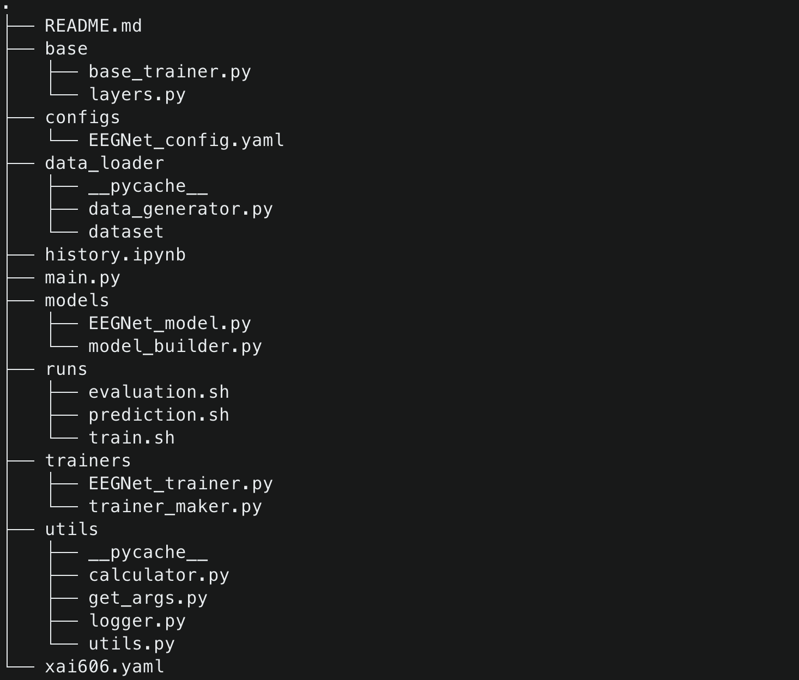
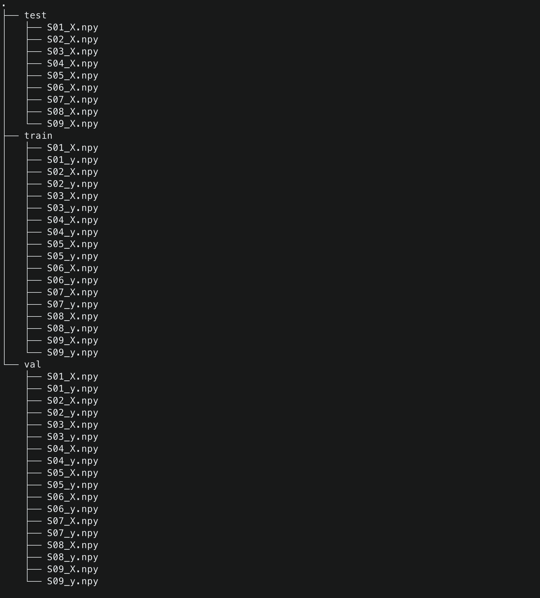

# XAI606

This repo contains the non-official implementation of [EEGNet](https://arxiv.org/abs/1611.08024) pytorch version.

## 1. Installation

### Environment

- Python == 3.7.10
- Pytorch == 1.9.0
- CUDA 11.0

### Dependencies

**Create conda environment**

- conda == 4.10.1

(Option 1) Using yaml file

```shell
conda env create —-file xai606.yaml
```

(Option 2) Install packages manually

```shell
conda install pytorch=1.9.0 cudatoolkit=11.1 -c pytorch -c nvidia
conda install numpy pandas matplotlib pyyaml ipywidgets
pip install torchinfo
```

## 2.Directory Structure



## 3. Dataset


**BCI Competition IV-2a dataset**
- 9 subjects 
- Classes: left hand, right hand, feet, tongue (4 classes)
- Session-to-session set up (=subject dependent)
- Training set: 216 trials per subject 
- Validation set: 72 trials per subject
- Test set: 288 trials per subject

**Preprocessing**
- Sampling rate: 250Hz
- Time segment: [0.5, 2.5]s post-cue
- Band-pass filtering: 0-38Hz
- Normalization: exponential moving average

## 4.Experiments
|Models|S01|S02|S03|S04|S05|S06|S07|S08|S09|Mean|
|:---:|:---:|:---:|:---:|:---:|:---:|:---:|:---:|:---:|:---:|:---:|
|EEGNet|76.74|54.51|79.17|54.51|63.19|57.64|83.68|75.00|68.40|68.09|

## 5. Get Started
**Train**
```shell
sh runs/train.sh
```

**Prediction**
```shell
sh runs/prediction.sh
```

XAI606-EEGNet

Project for XAI606(Korea University)
